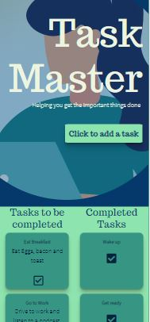
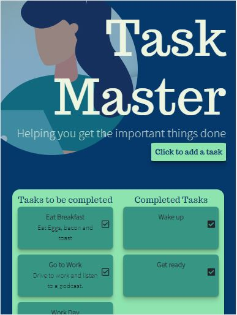
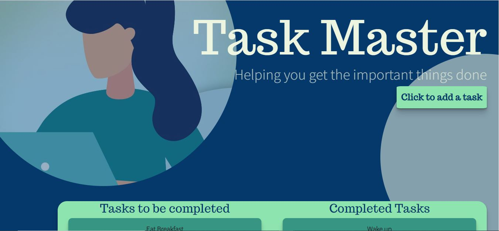

# Task Master

## Purpose
This project was another express app using mysql and express-handlebars. I wanted to familiarize myself further with the technology while making a useful app. In the bootcamp we made a pretty useless (in terms of real world application) app in which a user could add cheeseburgers and devour them. This was basically an excersise in using mySql to change elements in a table and render them in various ways using handlebars. 

## Process
The process was basically to get my server up and running then I created and seeded a database using SQL. after that I created an ORM object that allowed me to use various object methods that called in the various mySQL syntax to perform the basic crud operations. The database was easy enough to create but understand the MVC paradigm and using ORM was the real learning experience. I would say I still need to apply this skill to a few more projects before I would consider it a skill. This project was very helpful in helping me further understand how to navigate the various folders and files in an MVC based project. 

I also took the time to apply some of the web design fundamentals I have been studying on the side. I styled the app for a phone and iPad and a desktop moniter to freshen up on mobile first and responsive design. I tried to incorporate an beautiful UI with an easy to follow UX. This is the first time that I have really put a focus on the design as well as the functionality of a site. 

## Languages 
JavaScript 
 
Handlebars 
 
CSS 

## Links
[GitHub](https://github.com/sharkattack182/express-task-master)
 
[Deployed](https://sharkattack182.github.io/express-task-master/.)
 

## Visuals

 

 

